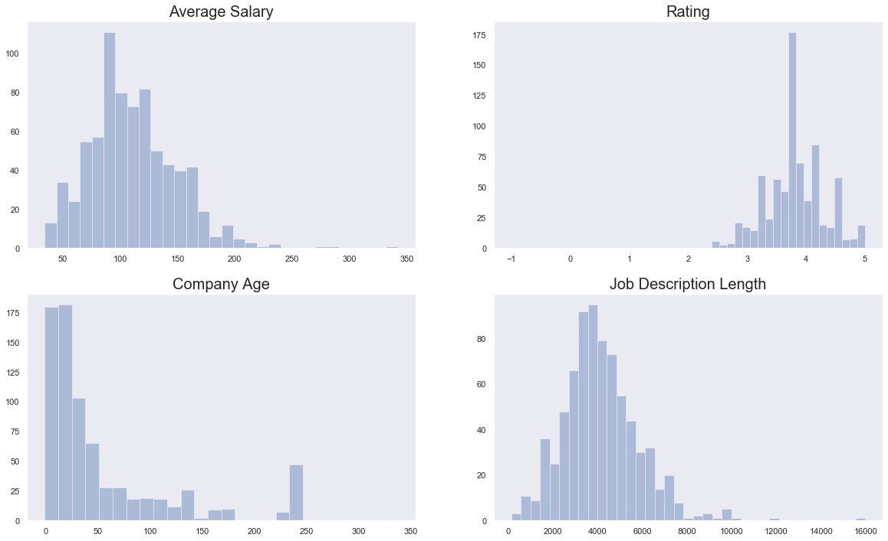
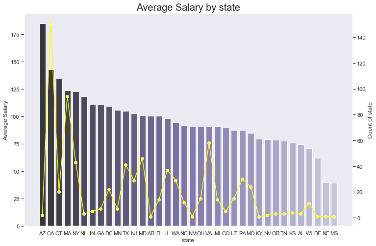
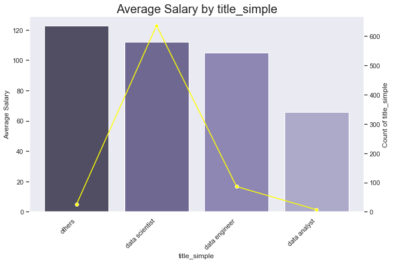

# Data Scientist Salary Prediction


This goal of this project is to predict data scientist salary.

## Steps
1. Scraped over 1000 job postings from Glassdoor using Python and Selenium.
2. Cleaned and manipulated unstructured data, extracted meaningful features from job descriptions, and performed
exploratory data analysis to understand the pattern and relationship of features and target.
3. Applied Linear Regression, Lasso, Random Forest, and used GridSearch to reach best model with MAE ~$14k.

## EDA

Here are some EDA results:

## References
* [Youtube Walkthrough](https://github.com/PlayingNumbers/ds_salary_proj)
* [selenium tutorial glassdoor on medium](https://towardsdatascience.com/selenium-tutorial-scraping-glassdoor-com-in-10-minutes-3d0915c6d905) - [code](https://github.com/arapfaik/scraping-glassdoor-selenium/blob/master/glassdoor%20scraping.ipynb)
